# Session 10250 - 使用 Xcode Playgrounds 原型设计

本文基于 [Session 10250](https://developer.apple.com/videos/play/wwdc2023/10250) 梳理。

> 通过使用 Xcode Playgrounds 对新代码进行原型设计，无需不断重新构建和重新启动项目来验证更改，一定程度上加快功能开发速度。本文将向您展示如何在项目或包中使用 Playground 来帮助您在各种方案中试用代码，并支持查看返回的值（包括复杂结构和用户界面元素），以便您可以在将功能集成到项目之前快速迭代该功能。

跟随本文指引一起来学习一下吧。

## 一、实战篇

### 1.1、下载源码

因为该 session 的源码官网并没有找到，所以本文根据视频内容简单的创建了 [HDPlaygroundsDemo](https://github.com/erduoniba/HDPlaygroundsDemo) 工程来分享该 session 对应的关键知识点。

下载之后，文件结构如下：

```sh
➜  HDPlaygroundsDemo git:(main) ✗ tree -L 2
.
├── End
│   ├── HDPlaygroundsDemo
│   └── HDPlaygroundsDemoEnd.xcodeproj
└── Start
    ├── HDPlaygroundsDemo
    └── HDPlaygroundsDemoStart.xcodeproj

6 directories, 0 files
```

使用 `Xcode15beta` 打开 `HDPlaygroundsDemoStart.xcodeproj` 即可进行下一步。

### 1.2、创建 Playground

在已有的工程中，不应该对之前的工程有所改动影响，所以这里依旧使用 iOS 模版，在过滤器栏中键入 `Playground` ，然后选择一个 `Blank Playground`

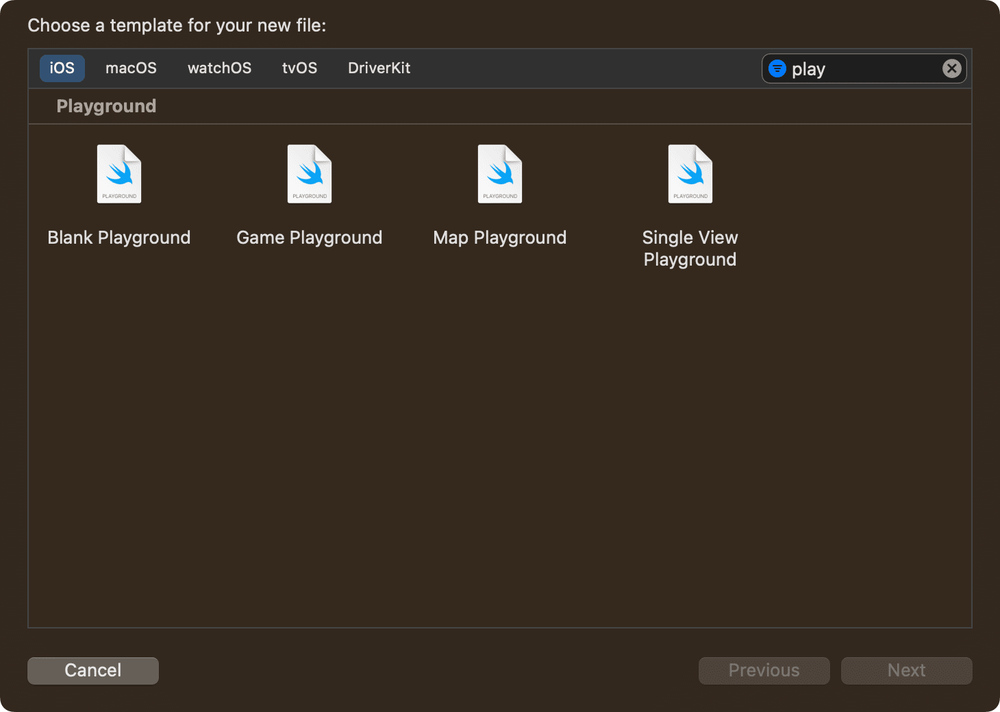

在这种情况下，因为是为了快速验证新代码的效果，创建的 "Playground"在验证后可能会被删除，所以我可以保留默认的 `MyPlayground` 名称即可。如下是创建好的工程：

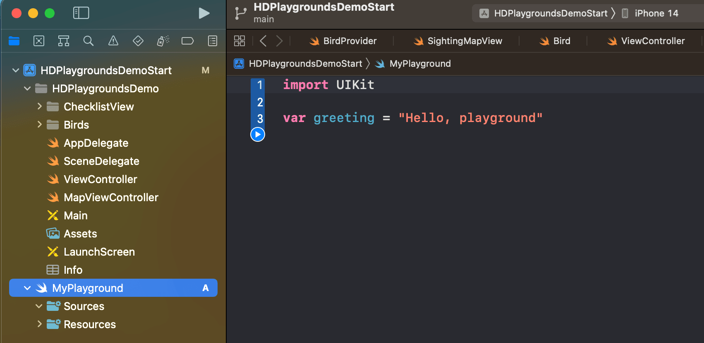

删除默认的 `var greeting = "Hello, playground"`代码后，长按底部栏上的运行按钮时显示的菜单中切换到 `Automatically Run` 以便更快地迭代验证。

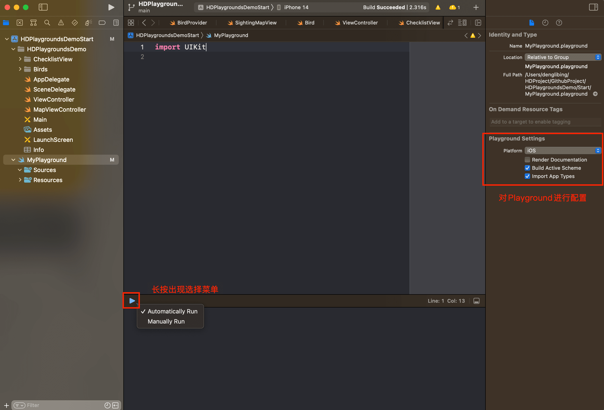

这会导致 `Playground` 在停止进行更改时自动执行整个代码。请注意，添加到工程的游乐场默认启用两个设置：构建活动方案和导入应用程序类型。他们将确保在每次操场执行之前构建活动方案，并自动导入应用程序目标模块。这使得使用项目中定义的类型变得更加容易。

### 1.3、使用 Playground 实时验证

```swift
let birdProvider = BirdProvider(region: .northAmerica)
let birdsToFind = birdProvider.birds.filter { $0.photo == nil }
let owlsToFind = birdsToFind.filter { $0.family == .owls }
```

#### 1.3.1、更详细的信息展示

在 `MyPlayground` 中添加如上代码后，右侧将自动展示 `birdProvider、birdsToFind、owlsToFind` 在没有添加任何辅助代码前效果。这里也展示一下分别使用 `Xcode14、Xcode15beta` 的对比：

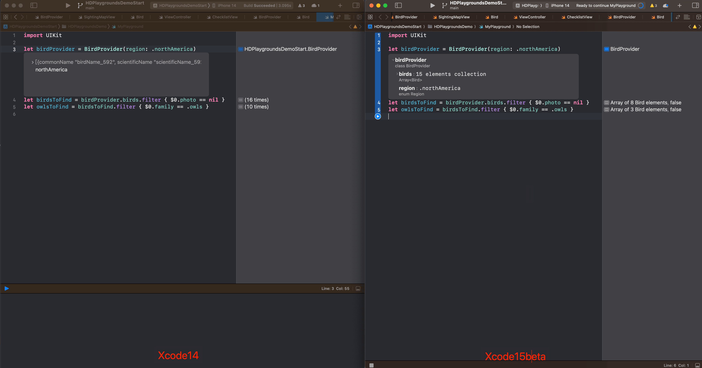

很明显使用 `Xcode15beta` 版本可视化的信息更多，包含 `birdProvider` 的类名、属性名+值及其类型，当然也可以一一展开获取更多信息，譬如将鼠标停留在 类名上，将扩展显示完整的信息。

#### 1.3.2、自定义对象的字符描述

现在，我们看到了 `region` 和 `birds` 属性的摘要。但默认情况下，展开 `birds` 后的每一行只告诉我们数组索引。这是因为自定义 `Bird` 类型未定义描述。我们可以通过使 `Bird` 类型符合 `CustomStringConvertible` 协议来改进这一点。

```swift
import Foundation

struct Bird {
    enum Family {
        case owls
        case crow
    }
    
    let commonName: String
    let scientificName: String
    let speciesCode: String
    
    let photo: UIImage?
    let family: Family
}

// 使得在 Playground 中展示Bird对象有如下的描述 （建议如下代码放在 Playground中的Sources中 ）
extension Bird: CustomStringConvertible {
    public var description: String {
        return "\(commonName) (\(scientificName))"
    }
}
```

因为会显示我们自定义的 `description` ，这样更加方便我们在 `Playground` 识别每一个元素。

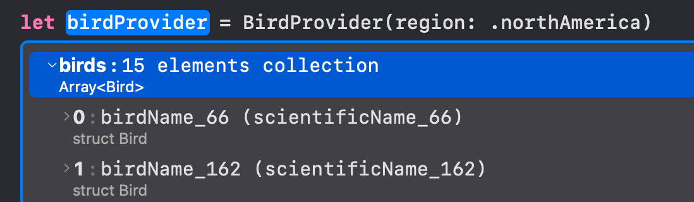

#### 1.3.2、自定义对象的可视化描述

每一个 `Bird` 对象中，包含了鸟类的图片，默认情况下，当我单击其行时，我的自定义 `Bird` 类型没有这样的预览。需要点击到 `Bird` 中的 `photo` 才能查看，像这样：

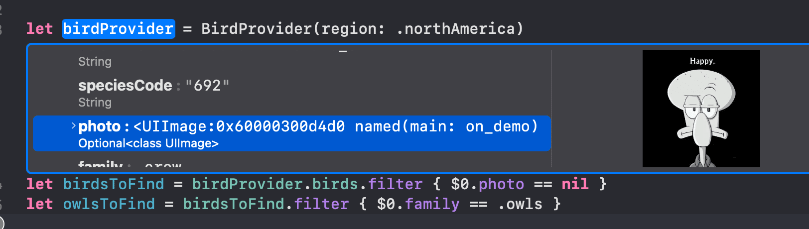

虽然可以通过这个方式查看到想要的图片信息，但是显得过于麻烦，幸运的是 `CustomPlaygroundDisplayConvertible` 协议可以帮我们解决。正如协议的名称所暗示的那样，这种一致性只影响操场表示，并且可以在点击到 `bird` 即可展示你想要的信息（而非继续从 `bird` 中点击 `photo`）

```swift
extension Bird: CustomPlaygroundDisplayConvertible {
    public var playgroundDescription: Any {
        return photo as Any
    }
}
```

再次回到 `MyPlayground` ，稍等一会将自动刷新后，单击其行后，照片将显示在新的基于拆分视图的用户界面中，这使我可以看到对象的结构以及预览。

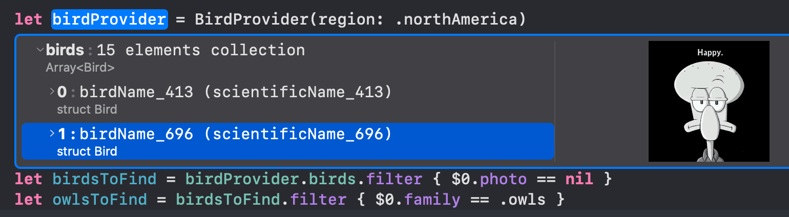

#### 1.3.4、视图的扩展

在 `MyPlayground` 继续添加视图：

```swift
let checklist = ChecklistView(frame: CGRect(x: 0, y: 0, width: 300, height: 600))
for bird in owlsToFind {
    checklist.add(bird)
}
```

`ChecklistView` 作为 `UIView` 子类，`Xcode15beta` 现在还显示一些属性以及快照信息：

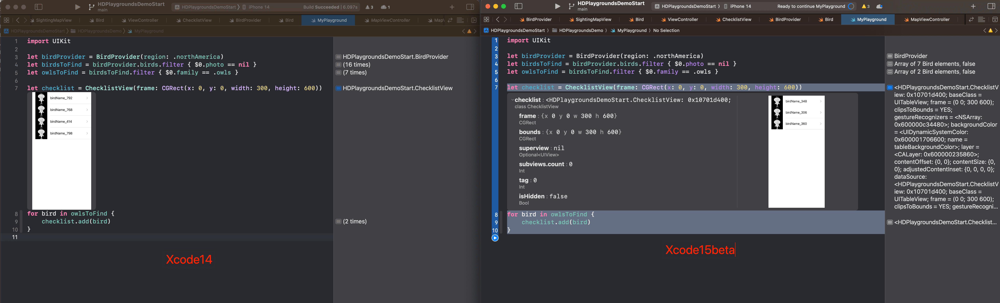

点击 `Value History` 可以查看数值历史记录模式：

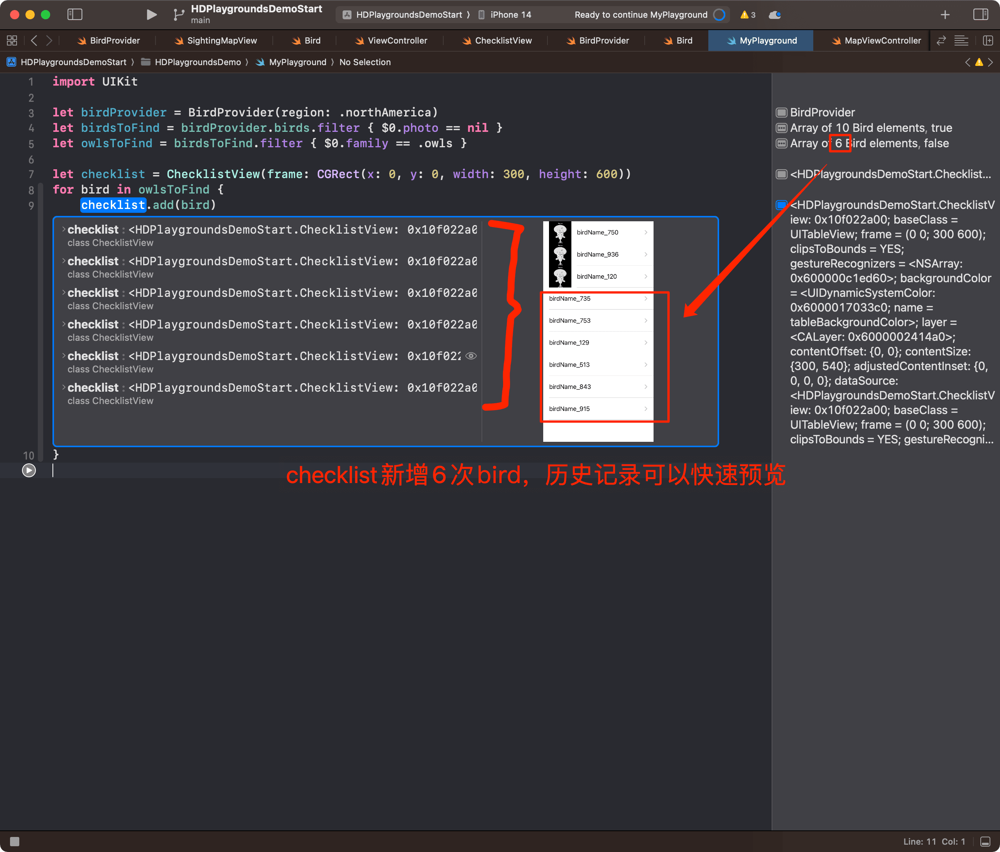

#### 3.5、MapKit 和 CoreLocation 的扩展

对于地图视图等复杂的用户界面元素，我们可以使用 `Playground` 实时视图来查看大型的完全交互式预览。要使用它，我首先需要导入 `PlaygroundSupport` 框架。

```swift
import CoreLocation
import PlaygroundSupport

if let bird = owlsToFind.first {
    let appleparkLocation = CLLocationCoordinate2D(latitude: 37.3348655, longitude: -122.0089409)

    let sightingsProvider = SightingsProvider()
    let sightings = sightingsProvider.fetchSightings(of: bird.speciesCode, around: appleparkLocation)
    
    if let mostRecentSighting = sightings.first {
        let sightingMapView = SightingMapView(sighting: mostRecentSighting)
        sightingMapView.frame = CGRect(x: 0, y: 100, width: 600, height: 600)
        PlaygroundPage.current.liveView = sightingMapView
    }
}
```

显示 `CLLocationCoordinate2D` 的预览：

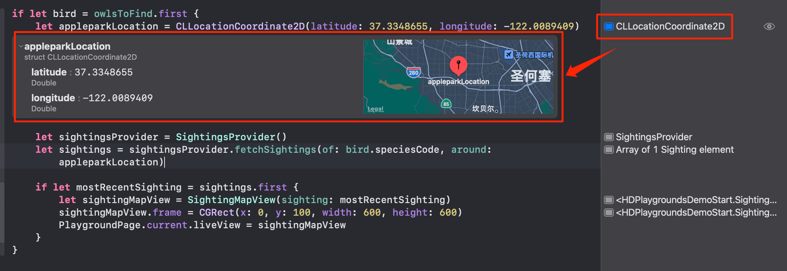

使用 `PlaygroundPage.current.liveView` 设置视图，然后点击右上角的 `Adjust Editor opertions` 勾选 `Live View` 就可以实时看到视图的布局了。

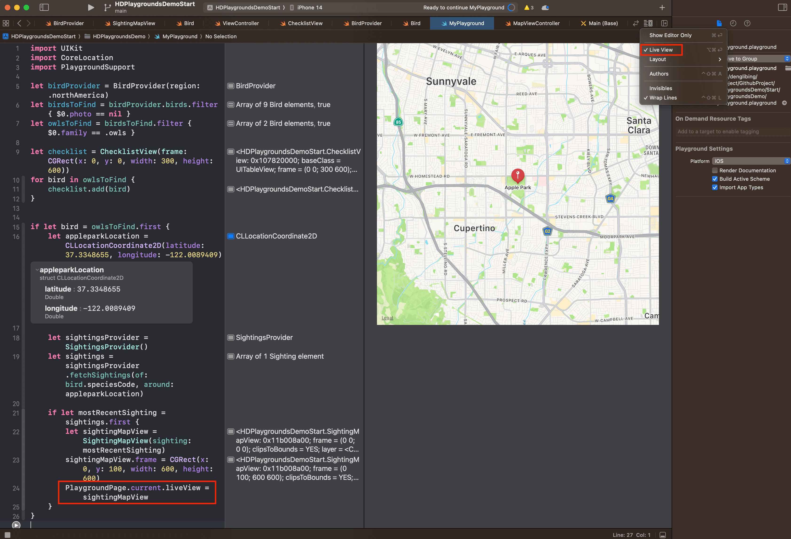

以上便是本 `session` 的实战内容了。

如果想直接想体验如上功能，使用 `Xcode15beta` 打开 `HDPlaygroundsDemoEnd.xcodeproj` 即可。


## 二、总结篇

在本 `session` 中，我们使用 `Xcode Playgrounds`  快速制作项目的新功能原型。

### 2.1、Customize Playground Representation

我们使用 `CustomStringConvertible` 和 `CustomPlaygroundDisplayConvertible` 协议来自定义自定义类型的表示形式。更快更详细的展示我们期望的数据。

### 2.2、Take Advantage of execution modes

我们了解了调整 `Palyground` 执行模式如何加快您的工作流程。

### 2.3、Use Value History mode

使用值历史记录模式使我们能够快速查看类对多个输入的反应。

### 3.4、Work with Live Views

最后，我们使用  `Palyground`  的实时视图仔细观察了复杂的用户界面元素。

相对于我们熟悉的热加载来说，还是差了一些，毕竟每次在 `Playground` 验证后，还得将代码复制拷贝到实际的工程中，编译运行看最终效果。同样的技术，不同的读者会有不同的想法和思路，相信你会有更多的使用场景来借用本 `session` 特性来更加高效的完成你的 `Prototype` 。
